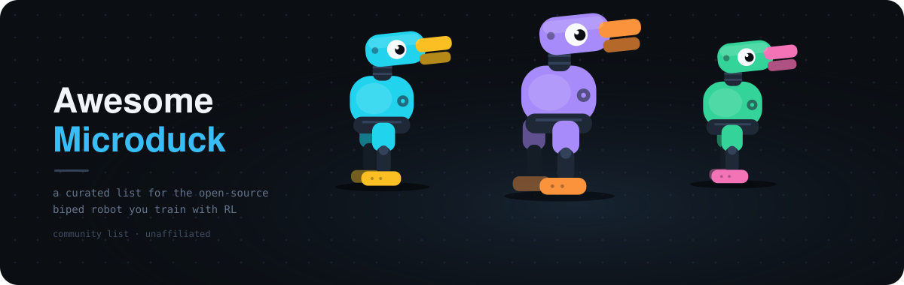

# Awesome Microduck 

> Software, simulators, policies, agent tools and coverage for Microduck, the open-source biped robot from Pollen Robotics and Hugging Face.

  

Microduck is a 25 cm, ~800 g walking duck with 15 motors, a camera, an 8×8 ToF depth sensor, two IMUs and a grasping beak. Every behavior it ships with (walking, sit/stand, kicking, ground pick, roller-skating, self-recovery) is a neural policy trained in MuJoCo and exported to ONNX, and the full sim-to-real stack is Apache-2.0 on GitHub. Pre-orders opened on 27 August 2026; first units are expected before Christmas 2026.

*Microduck is a product of [Pollen Robotics](https://pollen-robotics.com) and Hugging Face. This is an independent, community-maintained list — not affiliated with, endorsed by, or sponsored by either company. Product names, logos and brands are the property of their respective owners, and every linked project belongs to its own authors under its own license.*

## Contents

- [Ecosystem Status](#ecosystem-status)
- [Official](#official)
- [Documentation](#documentation)
- [Simulation and Training](#simulation-and-training)
- [Policies and Skills](#policies-and-skills)
- [Datasets and Benchmarks](#datasets-and-benchmarks)
- [Agent Tools and MCP](#agent-tools-and-mcp)
- [Community Hubs and Registries](#community-hubs-and-registries)
- [Apps and Ports](#apps-and-ports)
- [Hardware and Fabrication](#hardware-and-fabrication)
- [Articles and Coverage](#articles-and-coverage)
- [Videos](#videos)
- [Community](#community)
- [Lineage](#lineage)

## Ecosystem Status

The robot is pre-hardware: pre-orders are open, shipping is targeted for December 2026, and almost nobody outside Pollen has a physical unit yet. That shapes what is real today:

**Simulation tools work now.** The official browser sandbox, `microduck_rl`, and everything built on the published ONNX policies can be run and verified without a robot.

**Hardware-facing tools are pre-validation.** MCP servers, gateways and CLIs that target the real `robotd` API are written against the published design docs and mock transports; none listed here has been exercised on a shipped unit.

**Policy distribution is landing now.** Pollen published the nine shipped policies to the Hub as `microduck-policies` on 31 August 2026, and the policy channel (roadmap milestone M8) is being built on the `policy-hub-design` branch, with parts of it done as of the same date. The design sets a convention worth building against: one `.onnx` per Hub repo alongside a `manifest.json` giving observation and action dimensions, model API version and robot compatibility, driven by `robotctl policy list | load | reset | check | update | search`. None of it is on `main` yet, so today a policy still reaches a robot by hand.

Entries marked *sim-only* have not been validated on hardware.

## Official

- [pollen-robotics/microduck](https://github.com/pollen-robotics/microduck) - The robot's software: `robotd` 50 Hz control loop, `mediad` camera/WebRTC, `padd` gamepad, updater, and the nine shipped ONNX policies.
- [pollen-robotics/microduck_rl](https://github.com/pollen-robotics/microduck_rl) - RL training environments on mjlab (MuJoCo Warp) with PPO, BAM actuator models, backlash simulation and domain randomization. Needs a CUDA GPU.
- [pollen-robotics/microduck-gst-plugins](https://github.com/pollen-robotics/microduck-gst-plugins) - Prebuilt aarch64 GStreamer plugins (Rockchip MPP encoders, gst-plugins-rs WebRTC) used by the on-robot media daemon.
- [microduck-policies](https://huggingface.co/pollen-robotics/microduck-policies) - The nine shipped ONNX policies published as a standalone Apache-2.0 repository on the Hugging Face Hub, so they can be pulled without cloning the daemon.
- [Microduck Sandbox](https://huggingface.co/spaces/pollen-robotics/microduck-simulator) - Official in-browser simulator: MuJoCo compiled to WebAssembly plus onnxruntime-web running the real policies at 50 Hz, with gamepad support and the roller-skate variant.
- [Microduck Console](https://huggingface.co/spaces/pollen-robotics/microduck-console) - Official hosted console for driving a duck that is not on your own network, over WebRTC and Hugging Face sign-in.
- [Vision demo](https://huggingface.co/spaces/pollen-robotics/microduck-vision-demo) - Official Space that takes the duck's camera feed and runs the processing on Hugging Face hardware instead of on the robot.
- [microduck-emotions](https://huggingface.co/datasets/pollen-robotics/microduck-emotions) - Official Apache-2.0 dataset of emotional body-language animations, published so the duck and Reachy Mini can act scenes together.
- [microduck-duck-detector](https://huggingface.co/pollen-robotics/microduck-duck-detector) - Official one-class detector that finds *other* ducks in a duck's own camera, shipped as PyTorch, ONNX and INT8 RKNN for the robot's NPU and run on board by `duck-detect`. Scored at 0.80 mAP50, with every training run kept as a Git tag.
- [pollen-robotics/duck_detector](https://github.com/pollen-robotics/duck_detector) - The Apache-2.0 pipeline behind that model: capture, label, train and quantize, end to end.
- [Product page](https://pollen-robotics.com/microduck) - Specs, colorways and the launch story.
- [Store](https://store.pollen-robotics.com/products/microduck) - Pre-orders at $399.
- [Press kit](https://pollen-robotics.com/microduck/press-kit/) - Facts, full spec sheet, photos and downloads.
- [Meet Microduck](https://pollen-robotics.com/microduck/blog/introducing-microduck/) - Launch blog post from Pollen Robotics.

## Documentation

All from the `pollen-robotics/microduck` repository.

- [Docs index](https://github.com/pollen-robotics/microduck/blob/main/docs/README.md) - Map of every doc in the repo.
- [Cheat sheet](https://github.com/pollen-robotics/microduck/blob/main/docs/robot/cheatsheet.md) - `robotctl` commands for day-to-day use of the robot.
- [Architecture](https://github.com/pollen-robotics/microduck/blob/main/docs/design/architecture.md) - How the daemons, control loop, policies and updater fit together.
- [Design docs](https://github.com/pollen-robotics/microduck/tree/main/docs/design) - `robotd`, updater, remote WebRTC, boot recovery, restart order and the WebRTC console.
- [Policy channel design](https://github.com/pollen-robotics/microduck/blob/policy-hub-design/docs/design/policy-channel-design.md) - How community policies will reach robots: the Hub repo layout, the `manifest.json` contract and the `robotctl policy` commands. On a branch, not yet merged.
- [Roadmap](https://github.com/pollen-robotics/microduck/blob/main/docs/project/roadmap.md) - Milestones M1–M9, including the Hub model channel (M8) and autonomous brain (M9).
- [duckctl](https://github.com/pollen-robotics/microduck/blob/main/docs/robot/duckctl.md) - Controlling the robot from a laptop over Bluetooth.
- [Pair a gamepad](https://github.com/pollen-robotics/microduck/blob/main/docs/robot/pair-a-gamepad.md) - Bonding a controller to the robot.
- [Dev board setup](https://github.com/pollen-robotics/microduck/blob/main/docs/robot/install-dev.md) - Setting up a development board and pushing branches.
- [Contributing guide](https://github.com/pollen-robotics/microduck/blob/main/CONTRIBUTING.md) - Upstream contribution standards.

## Simulation and Training

- [microduck-rl-genesis](https://github.com/Macmachi/microduck-rl-genesis) - Genesis port of the walking task for AMD/ROCm GPUs, actuator model validated bit-exact against upstream. *Sim-only.*
- [Isaac Lab Microduck port](https://github.com/5usu/IsaacLab/blob/5usu/microduck-port/source/isaaclab_microduck/docs/README.md) - Isaac Lab extension with Microduck assets, BAM/backlash actuators and RSL-RL tasks for walking, kicking and parkour. *Sim-only.*
- [isaaclab-microduck](https://github.com/kabilankb/isaaclab-microduck) - Isaac Lab 3.0 (Newton MJWarp) port with locomotion, running, ball-kick and two-robot rally tasks, each A/B'd against the mjlab baseline. *Sim-only.*
- [microduck-ros2-isaac](https://github.com/osrbot/microduck-ros2-isaac) - Tutorial for driving the public Microduck model from ROS 2 Jazzy and NVIDIA Isaac Sim, with joint control in RViz and the released walking policy in USD. *Sim-only.*
- [microduck_description](https://github.com/adityakamath/microduck_description) - ROS 2 description package: URDF and xacro generated from the public model, with 38 visual meshes and a `robot_state_publisher` launch file.
- [microduck-ai-world](https://github.com/shaibuafeez/microduck-ai-world) - Embodied-AI playground pairing a robot runtime and RL policies with a detailed MuJoCo world and a vision-language brain that stays off the control loop. *Sim-only.*
- [microduck-lab](https://github.com/jvpflum/microduck-lab) - Reproducible training and evaluation workspace for NVIDIA DGX Spark that pins the official runtime, simulator and `microduck_rl` as submodules.
- [microduck-sim-playground](https://github.com/x10zyn/microduck-sim-playground) - Lightweight educational workspace: bootstrap script, CPU MuJoCo viewer with keyboard poses, upstream pinned as submodules.
- [microduck-rl-lab](https://github.com/AlexandreEDMOND/microduck-rl-lab) - Retrains five official skills and composes them into one automatic MuJoCo obstacle course. *Sim-only.*
- [microduck-miniverse](https://github.com/DollhouseRobotics/microduck-miniverse) - Every published ONNX policy repackaged as a deterministic Miniverse simulation bundle.
- [microduck-lab (Apple Silicon)](https://github.com/jonathanhawkins/microduck-lab) - Trains policies on a Mac with no CUDA GPU, against the same MJCF model and 61/14 contract as upstream, with a live browser viewer. *Sim-only.*
- [microduck-rl-on-thor](https://github.com/metahubaifeel/microduck-rl-on-thor) - Getting the official training stack to run on aarch64 CUDA hardware (Thor, DGX Spark, Jetson), with every trap documented and verified on real machines. In English and Chinese.
- [Microduck RL Ball Follow](https://github.com/yangyihai/Microduck_RL_Ball_Follow) - MuJoCo Warp training repo adding a target-following task, a command-block contract layer and a drag-the-ball demo. *Sim-only.*
- [Microduck School](https://huggingface.co/spaces/ysharma/gr-workflow-microduck-school) - Hosted Space where you set a lesson in plain English and watch the duck fail, retry and improve while the score climbs.
- [MicroDuck Playground](https://github.com/Vottivott/microduck-playground) - Independent continuation of `microduck_rl` collecting reproducible experiments, policy demonstrations and printable hardware add-ons, rebased on a pinned upstream commit.
- [Wicroduck](https://github.com/ngxson/wicroduck) - Attempt to put the whole loop behind a URL: MuJoCo compiled to WebAssembly steps the real MJCF in the browser with no Python and no backend. Simulation works today; in-browser training is the goal, not yet the state. *Sim-only.*
- [isaaclab_microduck](https://github.com/dreamerarun/isaaclab_microduck) - Full port of the official training stack to IsaacLab and PhysX: 37 environments across walking, collision, roller, backlash and testbench models, BAM M6 actuator dynamics, PPO configs and ONNX export. The published checkpoint is an integration smoke test, not a converged gait. *Sim-only.*
- [microduck-rl-torch](https://github.com/bsprenger/microduck-rl-torch) - PyTorch-native rewrite of the training stack for machines without CUDA, with the same workflow carried up to an NVIDIA box or the cloud. Continuous integration and coverage on every commit. *Sim-only.*
- [MicroDuck Unity Sim2Sim](https://github.com/sgyli7/MicroDuck-Unity-Sim2Sim) - Runs the official MJCF and ONNX policies inside Unity/Tuanjie with native MuJoCo kept as the physics authority and Barracuda doing inference, so the engine owns only scene, input and rendering. A [Godot/Jolt counterpart](https://github.com/sgyli7/MicroDuck-Godot-Simi2Sim) exists. Non-commercial use only, per the model license. *Sim-only.*
- [MicroDuck Swan Lake](https://github.com/jjshdbndg/microduck-motrixsim) - Trains a walking policy in the MotrixSim simulator, then blends it per joint with open-loop choreography (policy on the legs, choreography on the head and neck) for a two-minute ballet with a written root-cause log. In Chinese. *Sim-only.*
- [duckbench](https://github.com/craigm26/duckbench) - The physics bench under the golden vectors and the scored challenges: MuJoCo plus the shipped policies behind an HTTP service, a WebAssembly phone build, and the same bench exposed as MCP tools. Every published number names the plant it was measured in.
- [mjlab-sycl](https://github.com/guang384/mjlab-sycl) - Companion package that gets mjlab's CUDA-only path training on an Intel integrated GPU or Arc card without editing your project: install it into the same environment and run one overlay command. Apache-2.0, with continuous integration. *Sim-only.*
- [Microduck RL one-click toolkit](https://github.com/OneRobotAI/microduck) - Two scripts that take a bare Linux box from no environment to a usable gait and an exported ONNX with its validation, timed at about four hours on an RTX 5060 Ti. In Chinese. *Sim-only.*

## Policies and Skills

Community-trained policies and task definitions built on `microduck_rl`.
This section also publishes a versioned [machine-readable registry](policies.json)
for MicroDuck Lab and DuckHub.

- [microduck-backflip](https://github.com/Lulzx/microduck-backflip) - Reproducible mjlab backflip task with an evaluation battery, experiment log and explicit safety gates. *Sim-only.*
- [microduck-courier](https://github.com/selinayfilizp/microduck-courier) - Pick-carry-place task in an apartment scene with a trained policy, rollout clip and telemetry. *Sim-only.*
- [Jump playground](https://github.com/Liyucheng1997/318_lab-microduck-simulator) - Browser sandbox fork with a custom-trained vertical-jump policy; [live demo](https://duck.liyucheng.me). *Sim-only.*
- [microduck-sidekick-dance](https://github.com/pezzonovante7/microduck-sidekick-dance) - Drop-in mjlab task for a lateral dance step, with reward design notes. Task only, not yet trained.
- [microduck-step-up-policy](https://github.com/bihaokun/microduck-step-up-policy) - Policy pair for crossing a 25 mm square-edged step using the head as a temporary brake, then recovering upright; weights on the [Hub](https://huggingface.co/Nupr-Haokun/microduck-step-up-head-brake). *Sim-only.*
- [microduck-max-height-jump](https://github.com/ThomasBurgess2000/microduck-max-height-jump) - Deployable ONNX export and reproducibility evidence for a one-shot PPO jump, with the height claim stated as a training objective rather than a physical maximum. *Sim-only.*
- [microduck-walking yaw ablation](https://github.com/alertform/microduck-walking) - Single-variable reward ablation that cuts yaw-rate variance against the released `alpha_walking` baseline, with the evaluation harness that makes the comparison reproducible. *Sim-only.*
- [Microduck Circus](https://github.com/ros-claw/microduck) - Three ducks learn to skip a shared long rope, two turning and one jumping, through an act-fail-practice-adapt agent loop with a holdout round. *Sim-only.*
- [nottyduck](https://github.com/reachjalil/nottyduck) - Desk-companion persona with trained gesture policies, a 3D office mapper and a Hugging Face Jobs training CLI; policies on the [Hub](https://huggingface.co/reachjalil/nottyduck-policies).
- [microduck-flamingo-cycle](https://huggingface.co/RemiFabre/microduck-flamingo-cycle) - One-legged flamingo pose policy on the Hugging Face Hub.
- [microduck-polite-bow](https://huggingface.co/fffiloni/microduck-polite-bow-b1d864) - Bow gesture policy on the Hugging Face Hub.
- [microduck-moonwalk-backward](https://huggingface.co/fffiloni/microduck-moonwalk-backward-55e6af) - Backward moonwalk gait on the Hugging Face Hub.
- [More policies on the Hub](https://huggingface.co/models?search=microduck) - The growing long tail of community-trained gaits and gestures, searchable on the Hugging Face Hub.
- [microduck-basketball](https://huggingface.co/HannesVonEssen/microduck-basketball) - Balances on a free-rolling size-7 basketball and follows velocity commands from proprioception alone, through a one-layer LSTM with no ball state in the actor inputs. Simulation and export checks pass; onboard timing and real-robot behavior are untested.
- [microduck-swing](https://huggingface.co/HannesVonEssen/microduck-swing) - Starts motionless at the bottom of a two-cord swing and pumps itself with its head and legs to a 173 degree span, with 71 of 100 randomized seeds clearing every full-horizon validity gate and rollouts rejected for cord slack, lateral drift or attachment misalignment rather than judged on angle alone. Printable seat and straps included. *Sim-only.*
- [microduck-stilts](https://huggingface.co/HannesVonEssen/microduck-stilts) - Eight forward-walking policies for stilts from 10 cm to 2 metres, each height its own ONNX graph, continuation checkpoint, manifest and video behind a machine-readable index, with the printable stilt hardware alongside. *Sim-only.*
- [microduck-running](https://huggingface.co/HannesVonEssen/microduck-running) - Running policy robustified from a 1.687 m/s speed frontier with velocity pushes, centre-of-mass variation and initial tilt, holding 1.651 m/s nominal and 1.612 m/s under a combined backlash and disturbance battery. The author calls it a hardware candidate and says heading and lateral drift remain substantial. *Sim-only.*
- [microduck-tricks](https://huggingface.co/langli11/microduck-tricks) - Three skills trained on Hugging Face Jobs and scored on held-out batteries against the shipped policies: a run into a forward roll that hands off from walking 200 times out of 200 where the official policy manages 86 percent, a cone slalom that clears 8 of 8 gates without a fall where the official policy clears 21 percent, and a one-foot skate that lifts a blade for 0.4 to 0.6 seconds of true single support and skates on, 24 takes without a fall. A sustained one-blade glide is reported as unreachable on this robot, with the measured ceiling. *Sim-only.*
- [microduck-onefoot-skate](https://github.com/hikarioyama/microduck-onefoot-skate) - Interim checkpoint on a sustained left-foot glide, published as method and measurements rather than as a result: the declared 2.0 second gate is cleared by only 1 episode in 64 and no stage has passed formal acceptance, but 96.9 percent hold a credible one-foot glide past 1.0 second and the best recorded is 2.14 seconds. Carries the learnable-authority audit that found 35 percent of every episode had nothing to learn, two spawn-state defects traced to wheel velocities in the observation, all 15 training runs as curves, signed decision records, and an ONNX path documented well enough to drive the policies without installing MuJoCo. *Sim-only.*
- [microduck-detector](https://huggingface.co/pngwn/microduck-detector) - YOLO11n detector that finds a Microduck in an image, 2.6M parameters, scored at 0.63 mAP50 on a held-out split of synthetic renders and real press photos; try it in [what-the-microduck](https://huggingface.co/spaces/pngwn/what-the-microduck).
- [Microduck RL 4096x6000](https://huggingface.co/Datawhale/Microduck-RL-4096x6000) - Velocity-tracking reproduction pinned to an upstream commit: 4096 parallel environments, 6000 PPO iterations, with intermediate checkpoints, the ONNX export, training config, TensorBoard events and closed-loop replay video all kept. *Sim-only.*

## Datasets and Benchmarks

Fixtures and scored tasks for checking a runner or a policy against numbers rather than against a video.

- [Policy golden vectors](https://huggingface.co/datasets/craigm26/microduck-policy-golden-vectors) - Observation and action pairs recorded from the shipped policies, so an independent runner can be checked against the same numbers. A conformance fixture, not weights.
- [Microduck Ball Challenge](https://huggingface.co/datasets/craigm26/microduck-ball-challenge) - Scored ball-chasing benchmark with the physics plant pinned by hash; a [stairs challenge](https://huggingface.co/datasets/craigm26/microduck-stairs-challenge) follows the same discipline. *Sim-only.*
- [Trajectory dataset](https://huggingface.co/datasets/allen73/microduck-trajectory-dataset) - Multi-modal state-action trajectories from the 14-DOF simulated robot, aimed at offline reinforcement learning and imitation. *Sim-only.*
- [Microduck detection dataset](https://huggingface.co/datasets/pngwn/microduck-detection-dataset) - Labelled bounding boxes over synthetic renders, composites and real press photographs, the training and validation split behind the detector above.

## Agent Tools and MCP

Ways for LLM agents and scripts to drive a duck.

- [joeynyc/microduck-mcp](https://github.com/joeynyc/microduck-mcp) - Agent-agnostic MCP server modeled on the real-robot `robotd` architecture: mock, MuJoCo sim, Unix-socket and SSH transports behind one tool set, with a safety layer. Hardware transports are pre-validation.
- [aj-dev-smith/microduck-mcp](https://github.com/aj-dev-smith/microduck-mcp) - MCP server driving the simulated duck (CPU MuJoCo with the official policies), with rendered camera frames as tool output and a live agent-experience debug page. *Sim-only.*
- [quackd](https://github.com/rokbenko/quackd) - LLM goal-planning daemon named after the duck's own services: describe a task in plain language and Claude, OpenAI, Gemini or Grok sequences the robot's existing skills. Bundled simulator, `.duck` task files, safety rules, MCP support, on PyPI. Since 0.4 it drives other small robots too.
- [meckie-duck-gateway](https://github.com/rangerchaz/meckie-duck-gateway) - Holds the robot's WebRTC/JSON-RPC session and re-exposes it as a small local HTTP API, with a hardware-free protocol double for testing.
- [OpenCastor Microduck integration](https://docs.opencastor.com/robots/microduck/) - Third-party robot-agent framework that discovers Microducks, sends intents through `robotd` and composes routines.
- [Strands Robots Microduck provider](https://strands-labs.github.io/robots/policies/microduck/) - Python/MuJoCo provider wrapping the shipped ONNX policies behind a common simulation and hardware interface.
- [Microduck Lab (gr.Workflow)](https://huggingface.co/spaces/ysharma/gr-workflow-microduck-lab) - Hosted Space that turns a plain-English routine into a sequence of the robot's skills through a language model, then plays it back.
- [quacksat](https://github.com/andreagenovese/quacksat) - Turns the duck into a roaming voice satellite, with interchangeable Home Assistant Wyoming, agent-bridge and direct backends selected from one config file.
- [MicroDuck TinyVLA](https://huggingface.co/spaces/AlexWortega/microduck-vla-simulator) - Vision-language-action model driving a live MuJoCo duck from a head-camera frame, the 61-float state and a plain-English instruction, all on ONNX Runtime CPU. *Sim-only.*
- [microduck-cli](https://github.com/agentculture/microduck-cli) - Same verbs for an agent and for a human: five noun groups over `robotd`'s own JSON-RPC socket, `--json` on every command, and an empty runtime dependency list. On PyPI; checked against the real daemon and the MuJoCo body.

## Community Hubs and Registries

- [MicroduckHub](https://microduckhub.com) - Community policy browser listing the shipped behaviors and Hub retrains, with one-click deploy planned for when upstream's model channel ships.
- [uDuck Registry](https://uduck-registry.pages.dev) - Independent catalog of community policy descriptors with contract specs and verification status.

## Apps and Ports

- [DuckKit](https://github.com/craigm26/duckkit) - The Microduck as a pure Swift package: runs the real ONNX policies with the real 61-float observation at 50 Hz, plus kinematics, protocol types and Linux tests.
- [microduck-sim (iPhone)](https://github.com/littlejohntj/microduck-sim) - The nine shipped policies plus MuJoCo running natively on iPhone in Swift/RealityKit, with an AR mode at true scale.
- [Microduck WebXR](https://github.com/ApurvK032/microduck-webxr) - Physics-driven Microduck for Meta Quest and ordinary browsers, with controller walking, learned skills, room placement and an autonomous wander mode.
- [Microduck Anatomy](https://huggingface.co/spaces/mishig/microduck-anatomy) - Interactive holographic anatomy viewer with staged component focus and exploded assembly views.
- [microduck-tracking](https://github.com/AlexBodner/microduck-tracking) - Multi-object tracking on top of roboflow/trackers that gives the duck a target lock, so it fetches one thrown ball past identical distractors.
- [Microduck AR](https://huggingface.co/spaces/multimodalart/microduck-ar) - WebXR adaptation of the official sandbox with AR placement and ground-pick interaction.
- [specs-microduck](https://github.com/kgediya/specs-microduck) - Hand-gesture teleoperation of the simulated duck from Snap Spectacles, with in-lens telemetry.
- [MicroDuckModels](https://github.com/IronSpiderMan/MicroDuckModels) - Browser simulator rebuilt on Three.js and React Three Fiber with MuJoCo WebAssembly physics and local ONNX inference, running all nine shipped policies. Readme in Chinese and English.
- [microquack](https://osolmaz.github.io/microquack/) - Procedural droid-voice synthesis for the duck: a Rust core rendered live in the browser via WebAssembly, also on [Hugging Face](https://huggingface.co/spaces/osolmaz/microquack).
- [RL Physics Overlay](https://github.com/carpentry-liu/rl-physics-overlay) - Dependency-free telemetry overlay for the browser simulator showing joint forces, torques, contacts and learning signals without blocking the training loop. In Chinese and English.
- [MicroDuckSwarm](https://github.com/virtualmagician/MicroDuckSwarm) - Authors a flock choreography once, compiles it to a show file preloaded on every duck, and syncs only the clock at showtime so a dropped network costs nothing. Runs against a protocol-faithful mock duck. *Sim-only.*
- [Microduck Studio](https://github.com/microai-lab/microduck-studio) - Local control room that puts `robotd` status, safe control and the MuJoCo body behind one browser page, deliberately duplicating none of the safety, inference or physics it fronts. Readme in English and Chinese.
- [Kinematic viewer](https://github.com/taherfattahi/microduck-rigid-body-kinematic-viewer) - Drag any joint through its real range and watch the chain follow, with axis, hard limits, trainable limits and home angle shown live. One `index.html`, no build step; also a [hosted Space](https://huggingface.co/spaces/TaherFattahi/microduck-rigid-body-kinematic-viewer).
- [3D bipedal teleop](https://huggingface.co/spaces/hwihwalab/microduck-3d-bipedal-teleop) - Browser digital twin driven by the shipped policies over ONNX Runtime, with omnidirectional teleoperation and reported velocity-tracking error. In English and Korean. *Sim-only.*
- [esp-duck](https://github.com/xingxingRealzyx/esp-duck) - All nine shipped policies compiled onto an ESP32-S3 and hot-swappable at runtime, holding 50 Hz with roughly two times margin on per-channel INT8 weights and FP32 activations, fed by the board's own IMU, with a quantization-accuracy gate that runs on the host, on the device and at every boot.
- [spacemit-microduck](https://github.com/fivif/spacemit-microduck) - Brain swap to SpacemiT RISC-V: the official Rust runtime cross-compiled natively for K3 and K1 boards driving the servo bus directly, training left on the existing x86 and GPU chain. K3 measured; K1 still in progress. In Chinese.
- [Microduck Arena](https://github.com/00make/microduck-arena) - Three-a-side reinforcement-learning football in the browser on MuJoCo WebAssembly and onnxruntime-web, with a [playable site](https://microduck-arena.com/). MIT, readme in English and Chinese. *Sim-only.*
- [microduck-viewer](https://github.com/MACRL2/microduck-viewer) - Runs a trained locomotion policy as plain JavaScript at 50 Hz with no inference runtime at all, against MuJoCo WebAssembly physics, as embeddable pages for an [interactive control textbook](https://macrl2.github.io/). No server, no build step. *Sim-only.*
- [Microduck Academy](https://github.com/kingsleyli920/microduck-academy) - Staged reinforcement-learning classroom for software engineers new to the field: read the task, write Python, run real tests and watch the result, all on one page, ending in the official 3D simulator. Independent and explicit about it. In Chinese and English.

## Hardware and Fabrication

The hardware is not open source (no BOM, CAD or PCB files), but the MJCF and STL meshes are public.

- [OpenMicroDuck](https://github.com/SaberOnGo/open-microduck) - Independent reverse-engineering and documentation project mapping what the robot contains and how its stack works, in English and Chinese, explicit that the hardware is not open source.
- [microduck-diy](https://github.com/ScrapMeta/microduck-diy) - Month-long build log for a hand-made duck from the public simulation meshes and printable parts, with staged files and a parts list. In Chinese.
- [microduck-replica](https://github.com/fanhao375/microduck-replica) - Reconstruction study deriving assembly and exploded drawings, CAD-importable assemblies, a fastener list and an electronics teardown (Radxa Zero 3W, TTL servo bus, the two custom boards) from the public MJCF, STL meshes and runtime source, in English and Chinese and not verified against physical hardware.
- [microduck-replica-cad](https://github.com/fanhao375/microduck-replica-cad) - The companion drawing set for that reconstruction: 56 editable SolidWorks parts and assemblies rather than meshes, plus a 21-page assembly manual, modelled from scratch by a named author. In Chinese.
- [microduck-hardware-replica](https://github.com/lingzolabs/microduck-hardware-replica) - FreeCAD multi-part assemblies, printable meshes and a planning-stage bill of materials derived from the public MJCF and STL models. In Chinese, and explicit that it is unaffiliated and unverified.
- [ChinaMicroDuck](https://github.com/Shiyao-Huang/ChinaMicroDuck) - Replication reference library: four costed manufacturing routes compared, an audit of which official assets may be reused under which license, environment verification reports and Chinese translations of the official docs.
- [Microduck build tutorial](https://github.com/AI-FanGe/Microduck-build-tutorial) - End-to-end build of a working small biped on a Raspberry Pi Zero 2 W: wiring, a flashable image, Wi-Fi and SSH setup, printable files, the deployment code that drives the Dynamixel bus from an ONNX gait, and the mjlab environment that trains it. Walking hardware on video. In Chinese.

## Articles and Coverage

- [TechCrunch](https://techcrunch.com/2026/08/27/hugging-face-is-selling-a-cute-399-open-source-duck-robot-microduck/) - Launch coverage.
- [Engadget](https://www.engadget.com/2245407/huggingface-and-pollen-robotics-opn-pre-orders-for-the-microduck-robot/) - Pre-order details and specs.
- [The Register](https://www.theregister.com/ai-and-ml/2026/08/27/hugging-face-offers-399-robot-duck-to-help-you-quack-the-ai-code/5293011) - Launch coverage with a developer angle.
- [The New Stack](https://thenewstack.io/hugging-face-microduck-robot/) - Why the duck is a reinforcement-learning teaching platform.
- [IEEE Spectrum](https://spectrum.ieee.org/video-friday-microduck-robot) - Video Friday feature.
- [Digital Trends](https://www.digitaltrends.com/cool-tech/pollen-robotics-microduck-aims-to-make-training-physical-ai-far-less-fragile-and-cheaper/) - On making physical-AI training cheaper and less fragile.
- [MarkTechPost](https://www.marktechpost.com/2026/08/28/pollen-robotics-hugging-face-microduck-399-open-source-rl-biped-robot/) - Technical summary of the RL stack.
- [Interesting Engineering](https://interestingengineering.com/ai-robotics/new-robot-duck-learn-from-its-mistakes) - Overview of the robot's fall recovery and learning loop.
- [Hacker News discussion](https://news.ycombinator.com/item?id=49462763) - Launch thread with 700+ points, including Pollen engineers answering questions.
- [Pointcast 031](https://mhoydich.github.io/pointcast-microduck/) - Long-form feature on the hardware, the open stack and programming behavior with agents.

## Videos

- [We made a new robot.](https://www.youtube.com/watch?v=RAtzEyGBGFU) - Official launch film from Pollen Robotics.
- [Meet Microduck, the $399 Tiny Robot You Can Teach New Tricks](https://www.youtube.com/watch?v=reiTh7K4KSc) - Official product overview.
- [Microduck Sim 2 Real](https://www.youtube.com/watch?v=szW7N_7B3tU) - Official side-by-side of policies in simulation and on the robot.
- [Hugging Face Pushes Deeper Into Robotics With MicroDuck](https://www.youtube.com/watch?v=LF7GmLKgvcc) - Bloomberg Tech segment.
- ['Microduck' robot enters growing market of AI toys](https://www.youtube.com/watch?v=i_IMO0knP3I) - Global News segment.

## Community

- [Pollen Discord](https://discord.com/invite/pollen-community-519098054377340948) - Official community server; the Microduck channels are where the team answers questions.
- [Pollen Robotics on Hugging Face](https://huggingface.co/pollen-robotics) - Organization page hosting the sandbox Space and models.
- [Pollen Robotics on YouTube](https://www.youtube.com/@PollenRobotics) - Official channel.
- [@pollenrobotics on X](https://x.com/pollenrobotics) - Official account.

## Lineage

Microduck grew out of Open Duck Mini, Antoine Pirrone's open-hardware BDX-style droid, and the Open Duck community still shares Discord space, actuator models and sim-to-real lessons with it.

- [Open Duck Mini](https://github.com/apirrone/Open_Duck_Mini) - The open-hardware predecessor: BOM, CAD, and the original mjlab training work.
- [Open Duck Mini Runtime](https://github.com/apirrone/Open_Duck_Mini_Runtime) - Raspberry Pi runtime for Open Duck Mini.
- [microduck_runtime (legacy)](https://github.com/TommyZihao/microduck_runtime) - Pre-launch Raspberry Pi runtime for the Microduck prototype; superseded by `pollen-robotics/microduck`.
- [microduck_maploc_rs](https://github.com/apirrone/microduck_maploc_rs) - Time-of-flight submap SLAM, relocalization and A\* planning in Rust, written by a Pollen engineer for the prototype duck runtime. The runtime it targets is not public; the crate is.

## Contributing

Contributions welcome! Read the [contribution guidelines](contributing.md) first.
